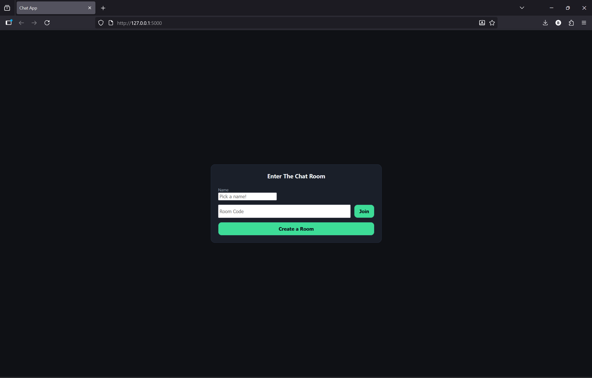
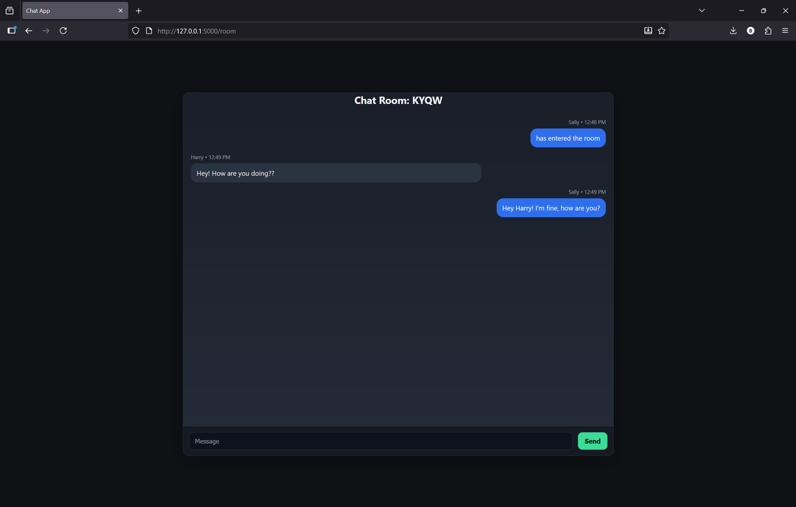

# Flask Chat App 💬

A lightweight **real-time chat room application** built with [Flask](https://flask.palletsprojects.com/) and [Flask-SocketIO](https://flask-socketio.readthedocs.io/).  
Users can create or join rooms via short codes and chat live with other participants.  

<p align="center">
  
  
  
</p>

---

## 🚀 Features
- **Create or join rooms** with unique 4-letter codes.
- **Real-time messaging** powered by WebSockets.
- **Message history** persists while the room is active.
- **Presence notifications** when users join or leave.
- **Responsive dark theme UI** with message bubbles and sticky composer.
- **Lightweight & self-contained** — no database required for demo.

---

## 📂 Project Structure
```
Flask-Chat-App/
│
├── main.py # Flask app + Socket.IO events
├── static/
│ └── css/
│ └── style.css # Dark theme + message bubble styling
└── templates/
├── base.html # Shared layout
├── home.html # Lobby (join/create room)
└── room.html # Chat room view
```

---

## ⚡️ Getting Started

### 1. Clone & set up environment
```bash
git clone https://github.com/yourusername/Flask-Chat-App.git
cd Flask-Chat-App
python -m venv venv
source venv/bin/activate   # on Windows: venv\Scripts\activate
```

### 2. Install dependencies
```bash
pip install -r requirements.txt
```bash

*Minimal requirements.txt*
```bash
flask>=3.0
flask-socketio>=5.3
python-socketio>=5.11
python-engineio>=4.9
eventlet>=0.36   # optional, recommended for production
```

### 3. Run the app
```bash
python main.py
```

### 4. Open the app
Open http://127.0.0.1:5000
- Tab 1 → Create a room.
- Tab 2 → Join with the code.
- Start chatting!

---

## 🖼️ Screenshots
| Lobby | Chat Room |
|---|---|
|  |  |

---

## 🛠️ Tech Highlights
- **Backend**: Flask, Flask-SocketIO, Python 3
- **Frontend**: HTML, CSS, Vanilla JS (Socket.IO client)
- **Transport**: WebSockets (with fallback to long polling if needed)
- **Architecture**: Stateless server + in-memory room/message store

---

## 📜 License
MIT License © 2025 [sebramvega]
